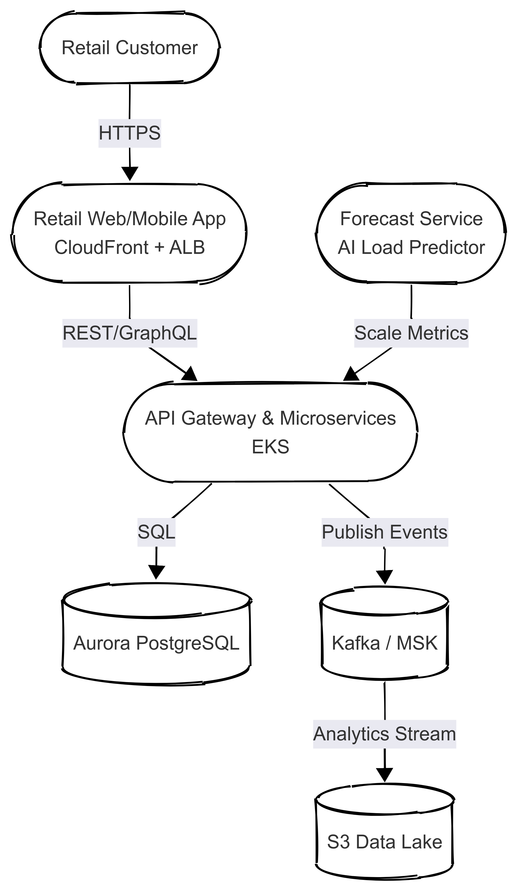

# Cloud Migration & Modernization with AI-Driven Autoscaling

## TL;DR
Migrate a legacy on-prem retail-analytics platform to AWS EKS + Aurora **and add a
machine-learning service that predicts cluster load one hour ahead for proactive autoscaling.**

## My Role
Principal/Lead Architect — cloud migration strategy, AI forecasting design, PoC deployment.

## Context & Problem
- Legacy: monolithic Java app + Oracle DB on aging hardware.
- Scaling pain: seasonal spikes caused 2–5 min autoscaling lag.

## Goals & Non-Functional Requirements
| Requirement         | Target         |
|---------------------|---------------|
| Availability        | 99.95 %       |
| Latency            | <200 ms P95   |
| Forecast accuracy   | ≥80 %         |
| Cost target         | ≤ $18k/month |
| Compliance          | ISO 27001, PDPA |

## Architecture Overview


- **Forecast Service (new)**: FastAPI + Prophet model pulls CPU/memory metrics from CloudWatch,
  predicts next-hour workload, and publishes a “desired replicas” signal to the HPA controller.
- Core: AWS ALB + CloudFront → EKS (Kubernetes microservices)
- Data: Aurora PostgreSQL + S3 data lake
- Messaging: Kafka on MSK
- CI/CD: GitHub Actions → ArgoCD

## Key Decisions (ADRs)
- [ADR-001: EKS vs. ECS](docs/adr/001-eks-vs-ecs.md)
- [ADR-002: Aurora vs. DynamoDB](docs/adr/002-aurora-vs-dynamodb.md)
- [ADR-003: Forecast-Driven Autoscaling](docs/adr/003-forecast-autoscaling.md) **⬅️ NEW**

## Proof of Concept
```bash
cd poc
pip install -r requirements.txt
uvicorn app:app --reload
# Visit http://localhost:8000/forecast
